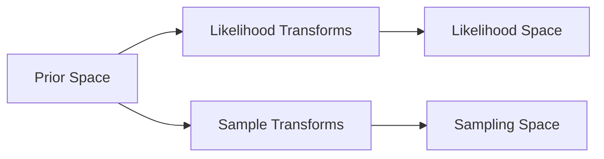

# Transforms

Jim bridges three parameter spaces, and transforms are the connections between them:



- The **likelihood space** is fixed by your waveform model. For example, ripple waveforms expect `(M_c, eta, s1_z, s2_z, ...)`.
- The **prior space** is where you define your priors. You are free to use whichever parameterisation is most natural.
- The **sampling space** is where the sampler explores. You can choose a parameterisation that reduces correlations between parameters or reduces multimodality in the posterior.

Of the three spaces, only the **likelihood space** is fixed — it is determined by what your waveform model expects as input. The **prior space** and **sampling space** are both your choices, and the transforms you need follow from those choices:

- **Likelihood transforms** bridge the gap from your prior space to the likelihood space required by the waveform model.
- **Sample transforms** bridge the gap from your prior space to the sampling space you want the sampler to explore.

For example, if your prior is on mass ratio `q` but the waveform expects `eta`:

- `MassRatioToSymmetricMassRatioTransform` (`q → eta`) belongs in `likelihood_transforms`.

If instead your prior is on `q` but you want the sampler to explore in `eta`:

- `MassRatioToSymmetricMassRatioTransform` (`q → eta`) belongs in `sample_transforms`.

## Likelihood Transforms

Likelihood transforms map from the **prior space** to the **likelihood space**. They are applied just before the waveform model is called, so they handle whatever parameter conversions the waveform model requires.

Likelihood transforms do **not** need to be invertible.

```python
from jimgw.core.single_event.transforms import (
    MassRatioToSymmetricMassRatioTransform,
    SphereSpinToCartesianSpinTransform,
)

# Prior is on (M_c, q, s1_mag, s1_theta, s1_phi, ...)
# Waveform expects (M_c, eta, s1_x, s1_y, s1_z, ...)
likelihood_transforms = [
    MassRatioToSymmetricMassRatioTransform,
    SphereSpinToCartesianSpinTransform("s1"),
    SphereSpinToCartesianSpinTransform("s2"),
]
```

## Sample Transforms

Sample transforms map from the **prior space** to the **sampling space**. Jim applies them to prior samples to obtain the initial positions in sampling space, and applies their inverses to proposed sampling-space points when evaluating the prior.

Sample transforms **must be bijective** (invertible), because Jim needs both forward and inverse directions.

```python
from jimgw.core.single_event.transforms import SkyFrameToDetectorFrameSkyPositionTransform

# Sampler explores (zenith, azimuth) in detector frame instead of (ra, dec)
sample_transforms = [
    SkyFrameToDetectorFrameSkyPositionTransform(trigger_time=gps_time, ifos=ifos),
]
```

## Available Transforms

All transforms are importable from `jimgw.core.single_event.transforms`.

### Mass transforms

Transforms marked *pre-instantiated* are ready-to-use objects exported directly from the module — use them **without parentheses** in your transform lists:

```python
# Correct:
likelihood_transforms = [MassRatioToSymmetricMassRatioTransform]

# Wrong — do not call it:
likelihood_transforms = [MassRatioToSymmetricMassRatioTransform()]  # TypeError
```

| Transform | Mapping | Notes |
| --- | --- | --- |
| `MassRatioToSymmetricMassRatioTransform` | `q → eta` | Pre-instantiated |
| `SymmetricMassRatioToMassRatioTransform` | `eta → q` | Pre-instantiated |
| `ComponentMassesToChirpMassMassRatioTransform` | `(m1, m2) → (M_c, q)` | Pre-instantiated |
| `ComponentMassesToChirpMassSymmetricMassRatioTransform` | `(m1, m2) → (M_c, eta)` | Pre-instantiated |
| `ChirpMassMassRatioToComponentMassesTransform` | `(M_c, q) → (m1, m2)` | Pre-instantiated |
| `ChirpMassSymmetricMassRatioToComponentMassesTransform` | `(M_c, eta) → (m1, m2)` | Pre-instantiated |

### Spin transforms

| Transform | Mapping | Notes |
| --- | --- | --- |
| `SphereSpinToCartesianSpinTransform(label)` | `(mag, theta, phi) → (x, y, z)` | Instantiate with spin label e.g. `"s1"` |
| `SpinAnglesToCartesianSpinTransform(freq_ref)` | Full precessing spin angles → Cartesian | Instantiate with reference frequency |

### Sky and extrinsic transforms

| Transform | Mapping | Notes |
| --- | --- | --- |
| `SkyFrameToDetectorFrameSkyPositionTransform(trigger_time, ifos)` | `(ra, dec) → (zenith, azimuth)` | Reduces ra/dec correlation for detector networks |
| `GeocentricArrivalTimeToDetectorArrivalTimeTransform(trigger_time, ifo)` | `t_c → t_det` | Conditional on ra, dec |
| `GeocentricArrivalPhaseToDetectorArrivalPhaseTransform(trigger_time, ifo)` | `phase_c → phase_det` | Conditional on ra, dec, psi, iota. Assumes dominant quadrupolar mode only ([arXiv:2207.03508](https://arxiv.org/abs/2207.03508)); **not valid** for waveforms with higher harmonics or precession. |
| `DistanceToSNRWeightedDistanceTransform` | `d_L → d_hat` | SNR-weighted distance parameterisation ([arXiv:2207.03508](https://arxiv.org/abs/2207.03508)). Assumes dominant quadrupolar mode only; **not valid** for waveforms with higher harmonics or precession. |

## Mapping a prior to the unit cube (for NS-AW)

The [BlackJAX NS-AW sampler](samplers.md#blackjax-ns-aw) requires the **sampling space** to be the unit hypercube `[0, 1]^n_dims`.
The `sample_transforms` must map every parameter from its physical support into `[0, 1]`.

The key tool is `BoundToBound`, which linearly maps `[a, b] → [c, d]`:

```python
from jimgw.core.transforms import BoundToBound

# Map chirp mass M_c ∈ [20, 80] to [0, 1]:
BoundToBound(
    name_mapping=(["M_c"], ["M_c_unit"]),
    original_lower_bound=20.0,
    original_upper_bound=80.0,
    target_lower_bound=0.0,
    target_upper_bound=1.0,
)
```

### Parameters with bounded physical range

Apply `BoundToBound` directly from the prior support to `[0, 1]`:

```python
sample_transforms = [
    BoundToBound(name_mapping=(["M_c"], ["M_c_unit"]), original_lower_bound=M_c_min, original_upper_bound=M_c_max, target_lower_bound=0.0, target_upper_bound=1.0),
    BoundToBound(name_mapping=(["q"], ["q_unit"]),     original_lower_bound=q_min,   original_upper_bound=q_max,   target_lower_bound=0.0, target_upper_bound=1.0),
    # ... repeat for each bounded parameter
]
```

### Angular parameters (sine / cosine priors)

Angular parameters must be trigonometrically transformed first:

```python
from jimgw.core.transforms import CosineTransform, SineTransform

sample_transforms += [
    CosineTransform(name_mapping=(["iota"], ["cos_iota"])),
    BoundToBound(name_mapping=(["cos_iota"], ["cos_iota_unit"]), original_lower_bound=-1.0, original_upper_bound=1.0, target_lower_bound=0.0, target_upper_bound=1.0),

    SineTransform(name_mapping=(["dec"], ["sin_dec"])),
    BoundToBound(name_mapping=(["sin_dec"], ["sin_dec_unit"]), original_lower_bound=-1.0, original_upper_bound=1.0, target_lower_bound=0.0, target_upper_bound=1.0),
]
```

### Power-law priors (e.g. luminosity distance)

For parameters with a power-law prior (not uniform), use the reversed `PowerLawTransform` so the sampling space is uniform on `[0, 1]`:

```python
from jimgw.core.transforms import PowerLawTransform, reverse_bijective_transform

sample_transforms += [
    reverse_bijective_transform(
        PowerLawTransform(
            name_mapping=(["d_L_unit"], ["d_L"]),
            xmin=d_L_min,
            xmax=d_L_max,
            alpha=2.0,
        )
    ),
]
```

This maps `d_L_unit ∈ [0, 1]` (where the sampler works) back to `d_L ∈ [d_L_min, d_L_max]` with a `d_L^2` prior, which is the volume-element prior for a uniformly distributed source population.

### Rayleigh priors

For parameters with a Rayleigh prior, use the reversed `RayleighTransform`:

```python
from jimgw.core.transforms import RayleighTransform, reverse_bijective_transform

sample_transforms += [
    reverse_bijective_transform(
        RayleighTransform(
            name_mapping=(["x_unit"], ["x"]),
            sigma=0.5,
        )
    ),
]
```

### Gaussian priors

For parameters with a Gaussian prior, use the reversed `GaussianTransform`.  The forward direction maps `u ∈ (0, 1)` to `x = mu + sigma * ndtri(u)` (probit function); the reverse direction is the normal CDF `x → ndtr((x - mu) / sigma) ∈ (0, 1)`:

```python
from jimgw.core.transforms import GaussianTransform, reverse_bijective_transform

sample_transforms += [
    reverse_bijective_transform(
        GaussianTransform(
            name_mapping=(["x_unit"], ["x"]),
            mu=0.0,
            sigma=1.0,
        )
    ),
]
```

## Passing Transforms to Jim

Both lists are passed to the `Jim` constructor:

```python
from jimgw.core.jim import Jim
from jimgw.samplers.config import FlowMCConfig

jim = Jim(
    likelihood=likelihood,
    prior=prior,
    sampler_config=FlowMCConfig(),
    sample_transforms=sample_transforms,
    likelihood_transforms=likelihood_transforms,
)
```

Either list can be empty. If `sample_transforms=[]`, the sampler operates directly in the prior space. If `likelihood_transforms=[]`, the waveform is called with the prior parameters unchanged.
