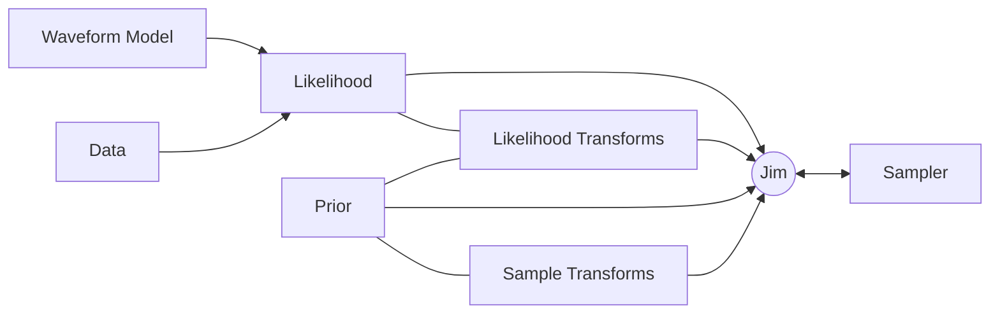

# Quick Start

The fastest way to run a gravitational-wave parameter-estimation analysis with Jim is the `jim-run` command-line tool. It takes a single TOML config file and handles the full pipeline — data loading, prior construction, transform inference, sampling, and output — with no Python scripting required.

## Bootstrap a config

Generate a GW150914-style template to start from:

```bash
jim-run --init gw150914.toml
```

This writes a ready-to-run config (shown below) and exits. Edit it to match your analysis before running.

## Config at a glance

```toml
seed = 0

[data]
type = "gwosc"
ifos = ["H1", "L1"]
trigger_time = 1126259462.4
duration = 4.0
post_trigger_duration = 2.0
psd_duration = 1024.0

[waveform]
approximant = "IMRPhenomXAS"
f_ref = 20.0

[prior]
M_c     = { type = "uniform",   min = 10.0,  max = 80.0  }
q       = { type = "uniform",   min = 0.125, max = 1.0   }
s1_z    = { type = "uniform",   min = -0.99, max = 0.99  }
s2_z    = { type = "uniform",   min = -0.99, max = 0.99  }
iota    = { type = "sine" }
d_L     = { type = "power_law", min = 1.0,   max = 2000.0, alpha = 2.0 }
t_c     = { type = "uniform",   min = -0.1,  max = 0.1   }
phase_c = { type = "uniform",   min = 0.0,   max = 6.283185307179586 }
psi     = { type = "uniform",   min = 0.0,   max = 3.141592653589793 }
ra      = { type = "uniform",   min = 0.0,   max = 6.283185307179586 }
dec     = { type = "cosine" }

[likelihood]
f_min = 20.0
f_max = 1024.0

[sampler]
type = "flowmc"
n_chains = 1000
n_local_steps = 100
n_global_steps = 1000
n_training_loops = 50
n_production_loops = 10
n_NFproposal_batch_size = 100
global_thinning = 100

[output]
dir = "output/my_run"
save_corner = false
```

Each top-level section has a single responsibility:

| Section | What it does |
| --- | --- |
| `[data]` | Where to get strain and PSD data — GWOSC, an injection, or local files |
| `[waveform]` | Which ripple waveform approximant to use |
| `[prior]` | Parameter names and their prior distributions |
| `[likelihood]` | Frequency band and optional features (heterodyning, marginalisations) |
| `[sampler]` | Sampler backend and its tuning parameters |
| `[output]` | Where to write results and which artefacts to save |

## Run

```bash
jim-run gw150914.toml
```

Add `-v` for debug-level logging. Progress is written to stdout:

```text
INFO | jimgw.cli | Loaded config from gw150914.toml
INFO | jimgw.cli | seed: 0
INFO | jimgw.cli | data: type=gwosc, ifos=['H1', 'L1']
INFO | jimgw.cli | waveform: IMRPhenomXAS (f_ref=20.0 Hz)
INFO | jimgw.cli | prior: 11 parameter(s): ['M_c', 'q', ...]
INFO | jimgw.cli | sampler: type=flowmc
INFO | jimgw.cli | Sampling complete.
```

## Outputs

Results are written to the directory specified by `output.dir`:

| File | Contents |
| --- | --- |
| `samples.npz` | Posterior samples array |
| `diagnostics.json` | Scalar sampler diagnostics (log evidence, acceptance rates, …) |
| `diagnostics.npz` | Array diagnostics (chains, log-prob traces, …) |
| `config.final.toml` | The resolved config — useful for reproducing a run exactly |
| `corner.png` | Corner plot (only when `save_corner = true`) |

Load the posterior samples in Python:

```python
import numpy as np

data = np.load("output/my_run/samples.npz")
samples = data["samples"]  # shape: (n_samples, n_params)
params  = data["parameter_names"].tolist()
```

## What's next

- **[Analysing GW150914 with the CLI](tutorials/gw150914_cli.md)** — a step-by-step walkthrough of a real event analysis.
- **[CLI Config Reference](guides/cli.md)** — all config sections, fields, and defaults in one place.
- **[Guides](guides/index.md)** — in-depth coverage of data loading, likelihoods, priors, samplers, and transforms.

---

## Using the Python API directly

For analyses that need custom transforms, non-standard likelihoods, or scripted workflows, Jim can be assembled programmatically. The core components are:



```python
from jimgw.core.jim import Jim
from jimgw.samplers.config import FlowMCConfig

jim = Jim(
    likelihood=likelihood,
    prior=prior,
    sampler_config=FlowMCConfig(n_chains=500, n_training_loops=20, n_production_loops=10),
    sample_transforms=sample_transforms,
    likelihood_transforms=likelihood_transforms,
)

jim.sample()
samples = jim.get_samples()
```

See the [Getting Started tutorial](tutorials/getting_started) for a complete programmatic example, and the [Guides](guides/index.md) for detailed documentation of each building block.
